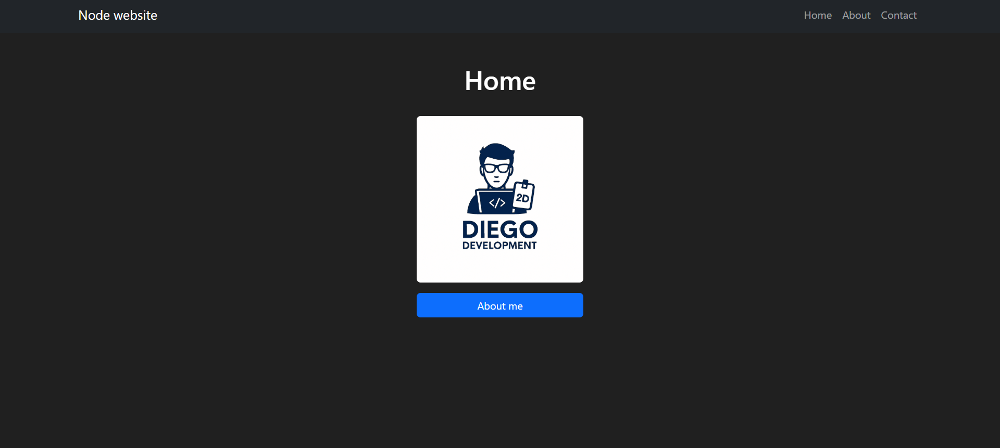

# First application with NodeJS

  - Configuración del proyecto
      - Instalación de express, ejs, morgan , nodemon
  - Creación de servidor con express
  - Express Routes
  - EJS, Tamplate engine, Navigation
  - CSS Global
  - Bootstrap 5
  - Mostrar Información en las diferentes rutas

``` bash
npm instal express

npm install ejs

npm install morgan

npm install nodemon -D
```


👀Nota!
- El modo de desplegar la pagina en HEROKU ya no es valida ya que el sitio web ya es de paga...


# Curso de Express JS
  - Instalación express, Module Client / Server --> img disponible
  - http (node) vs express --> levantar un servidor
  - Routing ('/routing'
  - http Methods (GET,POST,PUT,PATCH,DELETE)
  - http Response (res, res) => { res.send(), res.json()}
  - Request body --> res.body --> Content-Type: --> img disponible
  - Request params --> res.params -->  const { id } = req.params;
  - Request queries --> res.query --> --- /movies?genre=Terror ---
  - Introducción a los Middlewares --> app.use() --> img disponible
  - Introducción a los Middlewares parte 2 --> Autenticación --> img disponible
  - Express Settings
  - Express Router --> import Router
  - Template engine add EJS
  - EJS Partials
  - EJS Syntax
  - Async-Code add Axios --> img disponible

# REST API CRUD 📕
- Rest API CRUD Setup
- GET, POST, GET by ID
- DELETE by ID, PUT by ID


### Créditos a [fazt](https://www.youtube.com/watch?v=OVESuyVoPkI&t=3727s)
